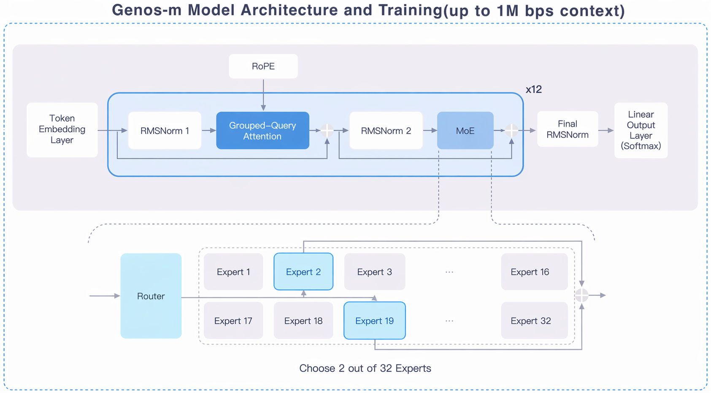
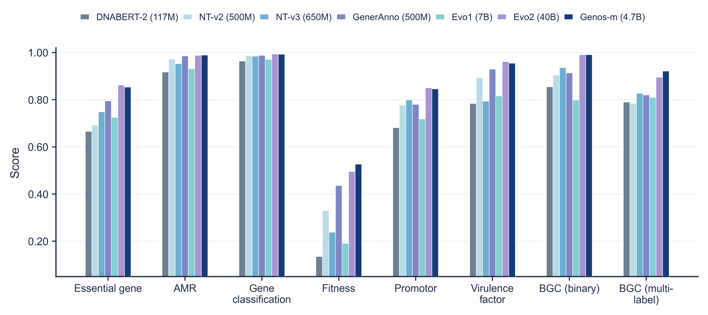
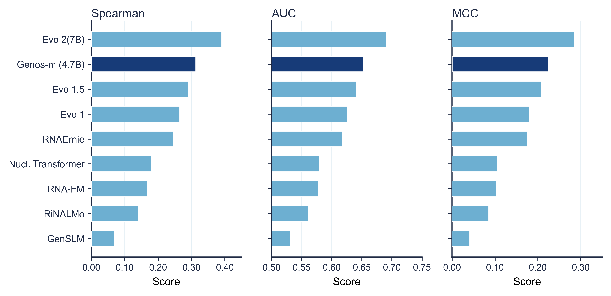
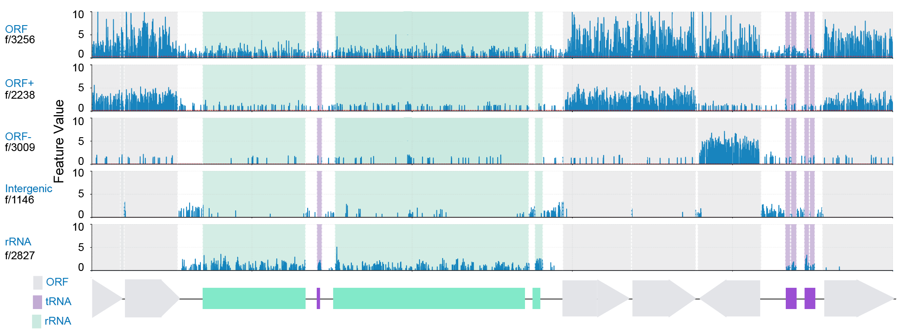
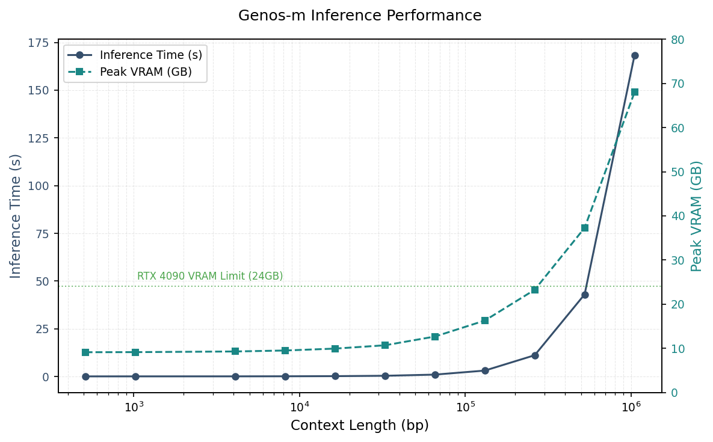
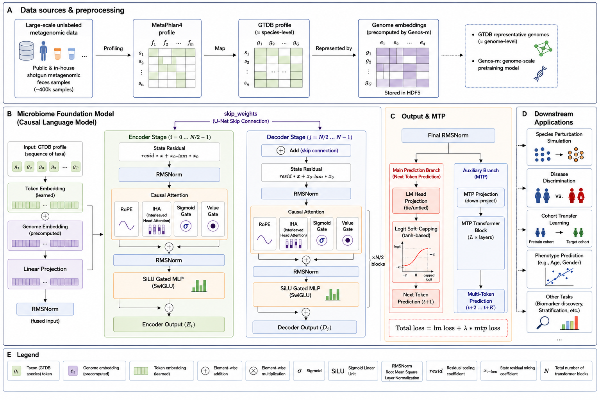
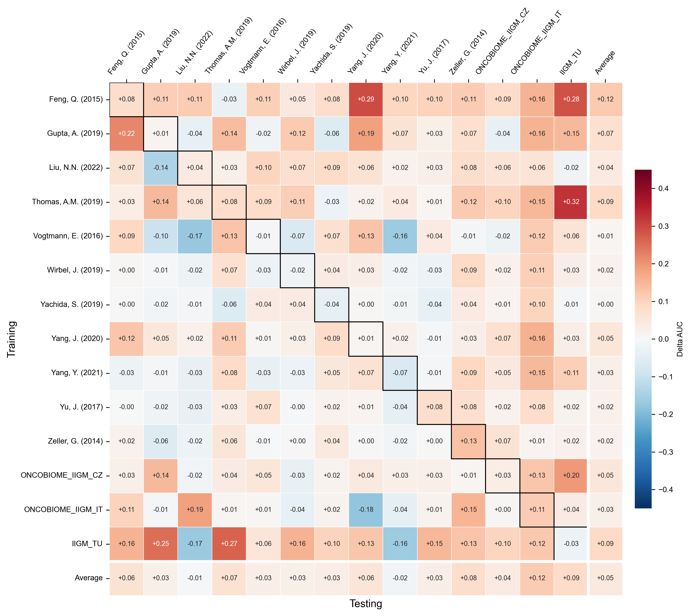
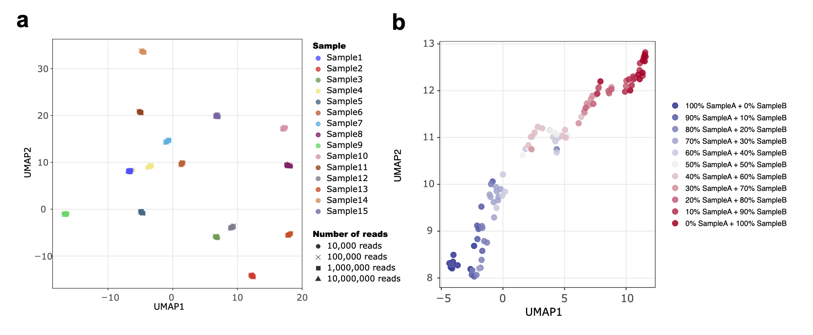
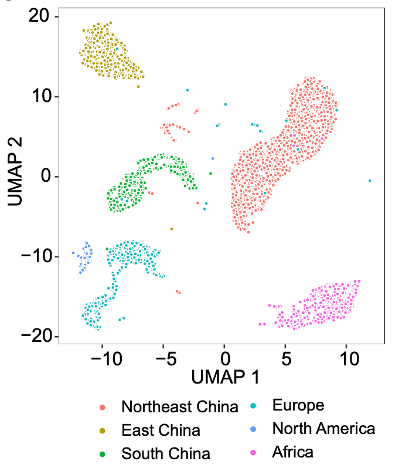
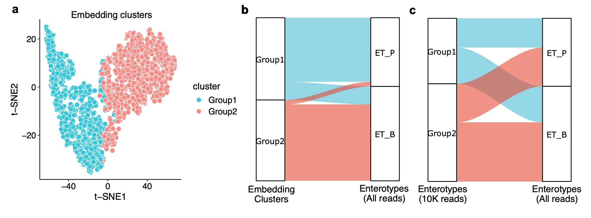

<div align="center">

# Genos-m：人类微生物基因组基础模型


[](https://huggingface.co/BGI-HangzhouAI/Genos-m)
[](paper/Genos-m.pdf)
[](LICENSE)
[](https://hitscounter.dev/)

[English](README_en.md) ｜ [中文](README.md)

</div>

## 目录

*   [模型概述](#model-overview)

*   [模型与数据](#model-and-data)

    *   [训练数据](#training-data)

    *   [模型架构](#model-architecture)

*   [性能测评与解释性分析](#evaluation-and-interpretability)

    *   [评测框架](#evaluation-boundary)

    *   [评测结果](#benchmark-results)

    *   [机械可解释性验证](#mechanistic-interpretability)

*   [部署与使用](#deployment-and-usage)

    *   [模型权重下载](#model-weights)

    *   [硬件与性能](#hardware-and-performance)

    *   [快速使用](#quick-start)

*   [应用案例](#use-cases)

    *   [应用用例概览](#use-case-overview)

    *   [案例 1：使用 Genos-m 基因组表征构建微生物组自监督学习模型](#case-1-microbiome-ssl)

    *   [案例 2：宏基因组个体隐空间库](#case-2-metagenome-latent-space)

*   [引用](#citation)

*   [许可证](#license)

*   [联系我们](#contact)

    
<a id="model-overview"></a>

## 模型概述

基因组基础模型的核心目标，是通过自监督学习将海量、多样且超长的 DNA 序列压缩并映射为可计算的连续表征，使序列片段、基因组及宏基因组样本等跨尺度生物序列对象能够在统一表征空间中被比较、检索、预测和复用。面向人源相关微生物基因组，该任务还需同时捕捉广谱原核微生物的基因组语义与人体微生态专属的目标域特征。在此，我们提出Genos-m，一个面向人源相关微生物基因组建模的开源基础模型。区别于面向跨生命域DNA序列的通用基础模型 \[1\]，其训练语料以人源相关微生物基因组为主体，涵盖原核分离培养基因组、宏基因组组装基因组（MAGs）及噬菌体基因组，并引入Genome Taxonomy Database（GTDB）原核物种代表基因组作为跨物种基因组语义的基础覆盖。

Genos-m 继承Genos\[2\]的主体结构，采用稀疏激活的混合专家（Mixture-of-Experts, MoE）Transformer 架构，总参数规模为 4.7B，单次激活参数约为 330M，并支持最长 1M bp 的上下文建模。该架构在控制训练与推理成本的同时提高模型的有效容量，使其能适配人源相关微生物序列语料中广泛存在的跨物种差异、菌株级遗传多样性及长程基因组上下文依赖。

Genos-m 的预训练语料采用分层构建与动态抽样策略。针对微生物基因组语料中普遍存在的组装不完整、污染和来源异质性，Genos-m实施了严格的数据质控，以减少低质量序列对学习上下文关系的潜在干扰。最终形成约1.2T tokens的预训练语料，覆盖 186 个门、3,448 个科和 69,056 个物种；其中保留的人源相关原核微生物子集覆盖 45 个门、585 个科和 12,273 个物种，涵盖肠道、口腔、皮肤、呼吸道和女性生殖道等主要人体微生物栖息环境。Genos-m采用反义链序列增强和多阶段上下文扩展策略，支持百万碱基级上下文建模。

在能力验证上，我们构建了覆盖不同序列长度与全基因组尺度的表征—任务评测体系，并结合 RNA 序列零样本迁移评估、机械可解释性分析及任务级应用验证。结果表明，Genos-m在多尺度评测中表现稳定；并以显著更小的参数规模在多项任务上达到与大规模通用 DNA 模型（如 Evo2-40B）相近或更优的性能。在应用层面，Genos-m通过为丰度模型中的物种特征提供基因组序列表征，提升了跨队列结直肠癌分类任务的性能；同时，其支持低深度宏基因组数据的稳定样本级表征，显示出在疾病风险建模和宏基因组表征场景中的应用潜力。

我们提供 Genos-m 模型权重、训练与推理代码、标准化评测基准，以支持研究者开展可复现、可评估和可扩展的模型复用、评测与方法开发。

<a id="model-and-data"></a>

## 模型与数据

<a id="training-data"></a>

### 训练数据

#### 预训练数据设计

Genos-m 的训练语料采用**分层构建策略**：

1.  引入GTDB 原核微生物物种 (species) 高质量代表基因组，学习基础原核基因组语义和跨物种共性。
    
2.  收集全球公开人源微生物基因组，涵盖共生与病原原核微生物及噬菌体，使模型聚焦人源相关微生物（human-associated microbes）这一目标域。
    
3.  引入内部高质量人肠道微生物基因组数据，扩展人群相关肠道微生物菌株多样性。
    

经严格质控与动态分层抽样，最终用于训练的语料规模为**1.2T tokens**。

#### 表1 Genos-m 预训练数据库来源与构成

| Dataset | Number of Tokens (**billions**) for pre-training | Genos-m <br>Dataloader Weight | Data<br>Link | References |
| --- | --- | --- | --- | --- |
| GTDB R220 (a) | 379（67,525 prokaryotic genomes used） | 31.30% | [https://data.ace.uq.edu.au/public/gtdb/data/releases/release220/220.0/](https://data.ace.uq.edu.au/public/gtdb/data/releases/release220/220.0/) | \[3\] |
| Huam-associated Prokaryotes: UHGG (b), AWI-Gen2 (c), gcMeta (d), IMGG (e), CGR (f), HROM (g), PMDB (h) | 446 (102,986 prokaryotic genomes used) | 36.85% | [https://ftp.ebi.ac.uk/pub/databases/metagenomics/mgnify\_genomes/human-gut/v2.0.2/](https://ftp.ebi.ac.uk/pub/databases/metagenomics/mgnify_genomes/human-gut/v2.0.2/)<br>[https://zenodo.org/records/14929430](https://zenodo.org/records/14929430)<br>[https://gcmeta.wdcm.org/download](https://gcmeta.wdcm.org/download)<br>[https://www.ncbi.nlm.nih.gov/bioproject/PRJNA482748](https://www.ncbi.nlm.nih.gov/bioproject/PRJNA482748)<br>[https://www.ncbi.nlm.nih.gov/bioproject/PRJNA903559](https://www.ncbi.nlm.nih.gov/bioproject/PRJNA903559)<br>[https://www.ncbi.nlm.nih.gov/bioproject/PRJNA763692](https://www.ncbi.nlm.nih.gov/bioproject/PRJNA763692)<br>[https://www.decodebiome.org/HROM/listdir.php?directory=data/genome\_catalog](https://www.decodebiome.org/HROM/listdir.php?directory=data/genome_catalog) | \[4-9\] |
| In-house human gut high-quality MAGs | 382 (89,320 prokaryotic genomes used) | 31.53% | In-house data |  |
| UHGV (i) | 3.8 (57, 514 phage genomes used) | 0.32% | [https://portal.nersc.gov/UHGV/genome\_catalogs/votus\_hq\_plus.fna.gz](https://portal.nersc.gov/UHGV/genome_catalogs/votus_hq_plus.fna.gz) | \[10\] |

(a) GTDB R220 is comprised of 584,382 bacterial and 12,477 archaeal genomes organized into 107,235 bacterial and 5,869 archaeal species clusters.  A total of 67,525 species-level representative genomes were used for training.

(b) The Unified Human Gastrointestinal Genome (UHGG) collection

(c) The Africa Wits-INDEPTH Partnership for Genomic Studies (AWI-Gen)

(d) Global Catalogue of Metagenomics (gcMeta)

(e) Inner Mongolian Gut Genome (IMGG)

(f) Culturable Genome Reference (CGR)

(g) The Human Reference Oral Microbiome (HROM)

(h) PMDB: The curated Pathogenic Microorganism Database (PMDB, BGI) includes over 40,000 pathogens, covering a broad range of bacteria, fungi, viruses, and parasites.

(i) Unified Human Gut Virome Catalog (UHGV)

#### 质量控制与处理策略

*   **质量控制**: 原核基因组满足条件: (1) 分离纯培养菌株 (isolates); (2) 宏基因组组装基因组 (MAGs): **完整性> 90%** 且 **污染度 < 1%** (CheckM，微生物基因组质量评估工具)；噬菌体: Confident genomes，包括 Complete (环状) 或 High-quality (>90% 完整度) 的噬菌体基因组（CheckV，病毒基因组质量评估工具）。
    
*   **数据增强**: 采用 **50% 反义链序列增强**
    
*   **长度扩展**: 训练阶段按 **8k / 32k / 128k / 1M** 渐进扩展上下文长度
    
*   **采样策略**: 按数据来源、生态位和物种分布进行分层动态抽样
    
*   **数据预处理**: 使用 "#" 字符连接来自同一基因组不同contigs, 将大于3个的连续N的片段，替换为"@"。
    

#### 人源微生物多样性与覆盖范围

*   **物种谱系**: 最终预训练语料覆盖 **186 个门、3,448 个科、69,056 个物种**；其中保留的人源相关原核微生物子集覆盖 **45 个门、585 个科、12,273 个物种**
    
*   **生态位分布**: 包括人肠道、口腔、皮肤、女性生殖道、呼吸道等主要人体微生物栖息环境
    
*   **地理分布**: 覆盖亚洲、欧洲、北美洲、非洲、大洋洲和南美洲等地区
    
*   **宿主关联**: 涵盖人体共生微生物、条件致病菌及人类相关病原微生物
    

**表2 Genos-m 预训练数据集组成概览：数据来源、生态位分布、地理分布及主要门构成**

| 维度 | 类别 | 估算比例 |
| --- | --- | --- |
| **数据集来源** | 内部数据集 | ~32% |
|  | 公开数据集（GTDB, UHGG、AWI-Gen2、gcMeta、IMGG、CGR、HROM、PMDB 等） | ~68% |
| **生态位分布** | 人肠道 | ~88.9% |
|  | 人口腔 | ~4.3% |
|  | 人皮肤 | ~1.5% |
|  | 人女性生殖道 | ~0.5% |
|  | 人呼吸道 | ~4.7% |
| **地理分布** | 亚洲（含内部数据集） | ~60.5% |
|  | 欧洲 | ~14.5% |
|  | 北美洲 | ~6.2% |
|  | 非洲 | ~6.0% |
|  | 大洋洲 | ~1.0% |
|  | 南美洲 | ~0.2% |
|  | 其他 | ~11.5% |


#### 数据质量特征

**高质量、低污染是 Genos-m 预训练数据的重要特征**。除分离培养菌株（isolates）外，纳入预训练的 MAGs 主要集中于完整性 > 90%、污染度 < 1% 的高质量区间。在污染度控制方面，本数据集采用了相比常规高质量基因组污染度 < 5% 更严格的筛选阈值。Genos-m 更强调训练数据的低污染特征；该设计旨在更充分保留真实的基因组序列结构，降低潜在污染（伪上下文模式）对模型训练的干扰，从而提升表征学习的稳定性、可靠性与可解释性。

<a id="model-architecture"></a>

### 模型架构



**图 1 |  Genos-m 模型架构.**  
> Genos-m 继承了 Genos \[2\]的核心 MoE（混合专家）架构与训练范式，同时系统性地增加了专家容量，以更好地对微生物基因组的多样性进行建模。具体而言，其混合专家前馈网络（Mixture-of-Experts FFN） 从较低的专家配置扩展至 32 个专家，并采用 Top-2 路由专家，从而将 FFN 的有效稀疏度（Sparsity）从 25% 降低至 6.25%。

#### 稀疏混合专家（MoE）设计

*   基于 Transformer 的混合专家网络，采用 Top-2 路由
    
*   专家数：32
    
*   总参数：4.7B
    
*   激活专家数：2
    
*   实际激活参数：330M
    

#### Tokenizer

*   单碱基Tokenizer
    
*   N 及 special token 不计入loss
    

#### 超长上下文能力

*   使用旋转位置编码（RoPE, Rotary Position Embedding），基数 50M，支持至 **1M tokens**
    
*   支持多维张量 / 管道 / 上下文 / 数据 / 专家并行
    

#### 训练与推理稳定性

*   梯度裁剪、专家负载均衡（aux loss + z-loss）
    
*   分组查询注意力（GQA, Grouped-Query Attention）降低 KV cache 开销，结合 Flash Attention 提升效率
    
*   推理阶段采用动态专家激活，支持百万碱基级单序列推理
    

**表3 Genos-m 训练架构与模型参数概览**

| **规格** | **Genos-m 4.7B** |
| --- | --- |
| **总参数** | **4.7B** |
| **激活参数** | 0.33B |
| **架构** | MoE |
| **专家数** | **32** |
| **Top-k** | 2 |
| **层数** | 12 |
| **Attention hidden** | 1024 |
| **注意力头** | 16 |
| **MoE FFN hidden** | 4096 |
| **词表** | 128 (pad) |
| **最长上下文长度** | 1M |

<a id="evaluation-and-interpretability"></a>

## 性能测评与解释性分析

<a id="evaluation-boundary"></a>

### 评测框架

Genos-m Benchmarks 从 **局部序列、区域级长上下文、全基因组表征**三个尺度对模型能力进行系统评测（详细评测项见 [Benchmarks 文档表 1：Genos-m Benchmarks 数据集清单与任务定义](Technical_Notes/Benchmarks.md)）。其核心目标在于评估预训练表示在不同尺度上对功能与表型相关信息的承载程度及其在标准任务设定下的可用性。

<a id="benchmark-results"></a>

### 评测结果

Genos-m 在多类任务中整体处于第一梯队，其中多数任务进入前三。

评测采用统一框架：监督任务默认冻结 backbone，提取最后层序列表示并通过 mean pooling 得到 embedding，在此基础上训练轻量MLP进行比较。分类任务报告 ROC-AUC / F1 / 准确率（ACC, Accuracy），回归任务报告 Pearson 相关系数。RNAfitness 任务为 zero-shot 评测，不进行微调，仅报告模型计算的整条序列 next-token average log-likelihood 值与实验 fitness 分数的 Spearman 相关系数。

#### 1. 序列理解任务

在局部序列理解任务中，Genos-m 在分类与回归任务中均处于第一梯队。

**短序列分类任务包括必需基因识别(Essential gene)、启动子识别(Promoter)、细菌基因六分类(Gene Classification)、抗生素抗性基因(AMR)和毒力因子(Virulence factor)识别**。Genos-m 在 5 项任务中均达到前二表现：在抗生素抗性基因识别任务中达到SOTA (AUROC=0.9896），并在启动子识别、毒力因子识别、必需基因识别和细菌基因六分类任务中分别达到 0.8460、0.9548、0.8534 和 0.9932，均接近或仅次于 Evo2-40B。详细结果见 [Benchmarks 文档表 2：局部序列分类任务预测性能比较（AUROC）](Technical_Notes/Benchmarks.md)。

**回归任务由 8 个基因适应性(Fitness)子任务构成，覆盖营养源变化与化学胁迫两类环境条件**（详见 [Benchmarks 文档表 3：Gene fitness prediction 子任务的环境条件分组与生物学含义](Technical_Notes/Benchmarks.md)）。其中，Genos-m 有 5 项达到 SOTA；包括以L-阿拉伯糖作为唯一碳源的培养条件：L-Arabinose (C);  以组氨酸作为补充营养源的条件: L-Histidine (nutrient)；以葡萄糖为碳源的基础最小培养基条件：Minimal media (glucose); 以丙酮酸作为碳源的培养条件: Pyruvate (C); 和高氯酸盐处理下的化学胁迫条件: Perchlorate（stress）。其余 3 项仅次于 Evo2-40B。详细结果见 [Benchmarks 文档表 4：不同环境条件下的基因适应性预测性能比较](Technical_Notes/Benchmarks.md)。

**在以生物合成基因簇（biosynthetic gene cluster, BGC）为代表的区域级长上下文任务中**，Genos-m在BGC / non-BGC 序列二分类判别(BGC(binary))上取得 AUROC = 0.9907，与 Evo2-40B（0.9911）相当；在BGC多标签分类任务(BGC(multi-label))上达到SOTA（AUROC=0.9216），优于 Evo2-40B（0.8951）及其他对比模型。结果说明，Genos-m 的区域级序列表征能够捕获与 BGC 存在性判别和类型区分相关的多基因上下文信息。详细结果见 [Benchmarks 文档表 6：BGC 区域序列判别与 BGC 类型分类任务性能比较](Technical_Notes/Benchmarks.md)。



**图2｜Genos-m 与基线模型在不同 benchmark 任务中的性能比较。**

> 除基因适应性预测（Fitness）外，各分类任务均报告 AUC；基因适应性预测报告 8 个基因适应性回归任务的平均 Pearson 相关系数。横轴任务覆盖必需基因识别、抗生素抗性基因识别、基因多分类、基因适应性预测、启动子识别、毒力因子识别、BGC 二分类和 BGC 多标签分类。

这些结果表明，Genos-m模型学习到的局部或长上下文序列表征能够支持多类基因功能任务，包括分类与条件相关的适应性预测。值得注意的是，Genos-m 仅以 330M 激活参数即可在多数任务中比肩或超越参数量超百倍的 Evo2-40B，表明其 MoE 架构与人源微生物基因组定向预训练策略在参数效率与任务泛化性之间取得了有效平衡。

#### 2. 突变感知任务

该评测基于 RNAGym 的 13 个原核相关 RNAfitness 数据子集，包含RNA突变序列及对应的功能变化，如表达水平等。数据集清单详见 [Benchmarks 文档表 5：RNAGym RNAfitness 原核相关 assays 子集数据概览](Technical_Notes/Benchmarks.md)\[13\]。首先对RNA序列进行 U→T 预处理后，模型在零样本条件下，**采用整条序列的 next-token 平均对数似然作为突变体得分，并在各 assay 内计算与实验结果的相关性后取平均**（Spearman 相关）。该任务旨在评估预训练模型本身是否已经内化了 RNA 的功能约束。

**Genos-m在相关性结果中取得平均Spearman相关系数0.313，在公开对比模型中排名第 2。**



**图 3 ｜Genos-m 与对比模型在 RNAGym RNAfitness 原核相关数据集中的零样本评测性能比较**

>模型分数按整条序列 next-token average log-likelihood 计算，并在每个 assay 内与实验 fitness 分数计算 Spearman 相关

这一结果表明，尽管 Genos-m 仅在 DNA 序列上进行预训练，其学习到的序列表征已隐式捕获了与 RNA 功能约束相关的信息。在无需任何额外训练的零样本条件下，Genos-m 即可对原核 RNA 突变体的功能变异进行有效排序，且在公开对比模型中排名第二，体现了 DNA 预训练表征向 RNA 功能预测任务的跨分子迁移能力。

#### 3. 全基因组理解任务

该评测基于 GIDEON（Global Infectious Diseases and Epidemiology Network）菌株表型数据库，包含菌株对应的整基因组序列及其基础离散表型标签（如革兰氏类型、需氧特性、运动能力、孢子形成及溶血活性，数据集链接 \[14\]:`macwiatrak/bacbench-phenotypic-traits-dna`)。数据集清单详见 [Benchmarks 文档表 7：全基因组表征评估中的菌株二分类任务标签与样本统计](Technical_Notes/Benchmarks.md)。对于 Genos-m，每个细菌基因组按 1M bp 切分为 chunks，逐 chunk 推理获得 chunk-level embeddings，再对所有 chunk embeddings 取平均，得到 genome-level embedding。评测时冻结 backbone，并在 genome-level embedding 上为每个表型训练独立的轻量分类器。数据按属（genus）划分训练/验证/测试集 (7:1:2)，以避免同一属信息泄漏。

在该任务中，Genos-m 在多个菌株表型预测任务中达到第一梯队，并接近 Bacformer 这类面向全基因组尺度建模的模型。

**表4 Genos-m 与其他模型在细菌表型预测任务上的性能比较（AUROC, mean ± SD）**

| **Model** | **GIDEON Gram positive** | **GIDEON Anaerobe** | **GIDEON Motile** | **GIDEON Spore formation** | **GIDEON Beta hemolysis** |
| --- | --- | --- | --- | --- | --- |
| **Mistral-DNA** | 65.58 ± 6.77 | 77.21 ± 2.99 | 66.98 ± 9.54 | 52.59 ± 21.62 | **63.40 ± 15.20** |
| **DNABERT-2** | 86.88 ± 5.47 | 88.84 ± 4.07 | 76.09 ± 2.49 | 72.71 ± 16.94 | <ins>62.26 ± 16.78</ins> |
| **Nucleotide Transformer** | 88.12 ± 8.21 | 90.90 ± 1.02 | 81.63 ± 3.84 | 79.25 ± 27.78 | 60.54 ± 16.54 |
| **ProkBERT** | 97.07 ± 3.41 | 92.50 ± 1.52 | 64.59 ± 5.22 | 83.66 ± 22.84 | 53.06 ± 5.76 |
| **ESM-2** | <ins>98.48 ± 1.69</ins> | 96.14 ± 1.34 | 82.07 ± 4.29 | 89.55 ± 8.27 | 54.80 ± 10.50 |
| **ESM-C** | **99.73 ± 0.29** | 96.57 ± 2.93 | 74.70 ± 8.69 | 89.91 ± 12.13 | 54.08 ± 6.86 |
| **ProtBERT** | 97.50 ± 2.39 | 97.92 ± 1.07 | 79.50 ± 6.52 | <ins>90.68 ± 7.52</ins> | 53.71 ± 12.93 |
| **gLM2** | 96.06 ± 4.29 | 91.08 ± 1.84 | 63.98 ± 5.82 | 74.53 ± 30.76 | 50.10 ± 5.57 |
| **Bacformer** | 97.61 ± 3.16 | **98.92 ± 0.37** | **87.01 ± 9.71** | **90.85 ± 10.38** | 52.05 ± 8.24 |
| **Genos-m** | 98.41 ± 1.77 | <ins>98.14 ± 0.57</ins> | <ins>83.22 ± 3.52</ins> | 90.24 ± 14.58 | 55.50 ± 1.59 |

这一结果表明，Genos-m 的序列级预训练表征在经由简单的 chunk 均值聚合后，即可在基因组尺度上保留与菌株基础表型相关的全局信息，并在无需专门的全基因组建模架构的前提下逼近 Bacformer 等全基因组专用模型的性能，提示其局部序列表征具有良好的跨尺度可组合性。

<a id="mechanistic-interpretability"></a>

### 机械可解释性验证

为检验 Genos-m 的预训练表征中是否存在可与已知基因组结构对应的可解释单元，我们引入稀疏自编码器（Sparse Autoencoders, SAEs）进行机械可解释性分析。SAE 通过过完备字典和稀疏性约束，将多语义的密集激活分解为近似单语义的稀疏特征。该方法已被用于自然语言模型和生物学语言模型的内部表征解析\[11,12\]；其中，部分稀疏特征可对应相对单一、可定位且可复核的序列或结构模式。在本研究中，我们对 Genos-m 的输出层进行 SAE 稀疏分解，并在基因组坐标上将高激活特征与已知注释区域进行对齐，以评估模型表征空间中是否存在可解释的基因组结构特征。

我们以大肠杆菌参考基因组 _E. coli_ NC\_000913.3 为对象，对 SAE 模型进行稀疏特征搜索。该组模型的隐藏维度为 4096，k = 128，batch size 为 4096，学习率为 5 × 10⁻⁵，训练 token 数约为 1B。结果显示，Genos-m 的部分稀疏特征可与多类已知基因组结构相对应。模型可识别与ORF, Intergenic, tRNA 和 rRNA 相关的高激活特征，并区分ORF正链与负链方向，**表明 Genos-m 的 hidden activations 中存在可映射至已知基因组结构的稀疏特征，为其序列表征提供了初步的机械可解释性证据。**

#### 方法简介：

##### SAE模型训练: 

训练数据共随机采样约30.5万个长度为32k的chunk，全部来源于模型预训练数据，其中以拟杆菌门（Bacteroidota，占比32.3%）为主。这些数据经Genos-m推理，提取最后一层激活并 1/10 下采样以降低冗余，随后全局打乱以确保任一 32k 窗口内的 token 不来自同一原始片段，最终训练 token 量约 1B。

SAE 以激活值 `x` 为输入，经单隐藏层宽 MLP 编码为稀疏特征向量 `f`，并重构得到 `x_hat`：

$$
f = \sigma(W_{\mathrm{enc}} x + b_{\mathrm{enc}})
$$

$$
\hat{x} = W_{\mathrm{dec}} f + b_{\mathrm{dec}}
$$

特征维度按扩展因子 `E` 放缩：

$$
d_{\mathrm{SAE}} = d_{\mathrm{model}} \cdot E
$$

本工作取 `d_SAE = 4096`。非线性激活 `sigma` 采用 Batch-TopK，即在批大小 `B` 的输入上仅保留全批次最大的 `kB` 个元素，其中 `k = 128`。损失函数为重构损失与辅助损失之和：

$$
L = \lVert x - \hat{x} \rVert_2^2 + \alpha L_{\mathrm{aux}}
$$

其中 `L_aux` 为死亡特征惩罚项。训练采用 batch size 4096、学习率 5 × 10<sup>-5</sup>、1 epoch。

**特征搜索与评估:**

为筛选与已知基因组结构相关的 SAE 稀疏特征，我们选取 ORF、intergenic、tRNA 和 rRNA 等明确注释区域，计算各特征在目标区域内的平均激活水平，并采用 1-vs-rest 策略与背景区域进行对比，以识别在特定注释区域中富集激活的候选特征。候选特征与注释区域的对齐程度通过 Domain F1-score 量化：将目标区域视为正类，Precision 定义为高激活位点落入目标区域的比例，Recall 定义为目标区域内被该特征高激活覆盖的比例，二者调和平均即为 Domain F1-score。激活阈值不预设固定值，而是在每个特征的激活强度范围内进行扫频，并选取使 Domain F1-score 最大化的阈值作为该特征的最优阈值。

**主要结果**：

*   可识别与 ORF 相关的高激活特征，并区分正链与负链方向
    
*   可识别 Intergenic, tRNA 和 rRNA 区域相关特征
    

这些结果说明模型内部确实包含与已知生物学结构相关的可分离特征。完整方法和结果见[论文 PDF](paper/Genos-m.pdf)。



**图4｜SAE 解析了原核基因组的语义特征**

**开源内容**：计划随项目开放 SAE 模型权重、SAE 训练代码和特征搜索代码。

<a id="deployment-and-usage"></a>

## 部署与使用

<a id="model-weights"></a>

### 模型权重下载

| 模型 | 总参数 | Hugging Face | Megatron ckpt |
| --- | --- | --- | --- |
| Genos-m | 4.7B | [Genos-m](https://huggingface.co/BGI-HangzhouAI/Genos-m) | [Genos-m-Megatron](https://huggingface.co/BGI-HangzhouAI/Genos-m-Megatron) |

<a id="hardware-and-performance"></a>

### 硬件与性能

以下结果在单张 **NVIDIA A800 80GB** 上测试。Genos-m-4.7B 的模型权重占用显存约为 **9 GB**，可在单卡上完成 **1M bp** 上下文推理。在 24GB 显存消费级 GPU 上，Genos-m-4.7B 可完成约 **200k bp** 上下文推理，能够覆盖多数微生物基因、基因簇及其邻域序列分析场景。



<a id="quick-start"></a>

### 快速使用

以下示例展示两类常用推理方式：提取序列 embedding，以及基于输入序列继续生成。

```bash
pip install torch transformers accelerate
```

#### 提取序列 Embedding

```python
import torch
from transformers import AutoModel, AutoTokenizer

model_id = "BGI-HangzhouAI/Genos-m"

tokenizer = AutoTokenizer.from_pretrained(model_id, trust_remote_code=True)
model = AutoModel.from_pretrained(
    model_id,
    torch_dtype=torch.bfloat16,
    device_map="auto",
    trust_remote_code=True,
).eval()

sequence = "ATGCGTACGTAGCTAGCTAGCTAGCTAGCTAA"
inputs = tokenizer(
    sequence,
    return_tensors="pt",
    truncation=True,
    max_length=8192,
).to(model.device)

with torch.no_grad():
    outputs = model(**inputs)

hidden_states = outputs.last_hidden_state
attention_mask = inputs["attention_mask"].unsqueeze(-1)
embedding = (hidden_states * attention_mask).sum(dim=1) / attention_mask.sum(dim=1)

print(embedding.shape)


```

#### 序列生成 Generation

```python
import torch
from transformers import AutoModelForCausalLM, AutoTokenizer

model_id = "BGI-HangzhouAI/Genos-m"

tokenizer = AutoTokenizer.from_pretrained(model_id, trust_remote_code=True)
model = AutoModelForCausalLM.from_pretrained(
    model_id,
    torch_dtype=torch.bfloat16,
    device_map="auto",
    trust_remote_code=True,
).eval()

prompt = "ATGCGTACGTAGCTAGC"
inputs = tokenizer(prompt, return_tensors="pt").to(model.device)
pad_token_id = tokenizer.pad_token_id
if pad_token_id is None:
    pad_token_id = tokenizer.eos_token_id

with torch.no_grad():
    output_ids = model.generate(
        **inputs,
        max_new_tokens=256,
        do_sample=True,
        temperature=0.8,
        top_p=0.95,
        pad_token_id=pad_token_id,
    )

generated_ids = output_ids[0, inputs["input_ids"].shape[-1]:]
generated_sequence = tokenizer.decode(generated_ids, skip_special_tokens=True)

print(prompt + generated_sequence)


```
<a id="use-cases"></a>

## 应用案例

<a id="case-1-microbiome-ssl"></a>

### 案例 1：使用 Genos-m 基因组表征构建微生物组自监督学习模型

#### 案例概要

本案例展示 Genos-m 在人体微生物组群落自监督建模中的应用。Genos-m 为每个物种的代表基因组预先生成 genome-level embedding；这些连续向量经投影后与物种 token 对齐，作为 genome-informed species representation 接入微生物组自监督学习模型。该模型是基于 Transformer 的人体微生物群落自监督模型（30 layers、hidden size 1792、14 attention heads），以物种相对丰度谱为输入，在约 400k 无标签人体微生物组样本上进行自监督训练，用于学习人肠道等多部位的微生物群落物种组成、共现关系和丰度结构。



**图5 | 微生物组自监督学习模型架构**


#### 模型架构

现有微生物组丰度相关的自监督模型\[27,28\]通常将物种(species)作为离散 token，主要基于物种层面的共现关系和丰度结构进行建模。然而，物种 token 本身并不直接包含其基因组序列信息，因此难以显式引入物种间基因组功能信号及差异。Genos-m 在该框架中提供了基因组层面的补充表征：将物种的代表基因组序列编码为连续向量，通过引入 genome-informed species representation，使群落模型能够在物种丰度结构之外接入基因组层面的序列表征。

在该微生物组自监督学习模型中，每个物种位置同时接收两类输入：可学习的 species token embedding 和 Genos-m 预先生成的 genome-level embedding。二者通过线性投影后加和。

该模型的 backbone 基于 nanoGPT 的 [slowrun](https://github.com/qlabs-eng/slowrun) 实现改造，目标是在有限数据量（100M tokens）下取得更好的训练效果。相较原生nanoGPT，采用了交错头注意力（IHA, Interleaved Head Attention）、RMSNorm、RoPE 和 U-Net-style skip connections 等结构改造以及诸多训练策略优化，以提升训练稳定性等。模型采用 abundance-sorted causal language modeling：将每个样本中的物种按相对丰度降序排列为其序列，模型根据前文物种预测后续物种，从而学习微生物群落的组成结构和丰度依赖关系。

#### 评估设计

下游评估沿用Piccinno et al. 的数据及方法\[26\]，使用其公开整理的 **14 个独立 CRC肠道宏基因组队列** \[15-26\]，覆盖亚洲、欧洲和北美人群。本任务以 Piccinno et al. 报告的基于物种相对丰度的Random Forest 分类器作为基线，比较微生物组自监督学习模型在相同队列设定下的CRC判别性能。在分类阶段，冻结自监督 backbone，仅训练轻量 MLP 分类头，以检验预训练表征的下游可用性。评估包括：

1.  **队列内交叉验证**：在单个队列内进行交叉验证，评估模型在队列内分类任务中的表现。
    
2.  **跨队列外部验证**：以单一队列作为训练集，并在其他队列上进行测试，评估模型在跨人群、跨研究队列的泛化能力。
    

#### 关键结果

在全球跨人群的 14 个 CRC 队列评估中，接入Genos-m 表征的微生物组自监督学习模型在队列内10-fold CV 中取得平均 AUROC = 0.89，高于传统物种相对丰度Random Forest baseline（AUROC = 0.86，**ΔAUROC = +0.03**）。在跨队列外部验证中，该模型取得平均 AUROC = 0.77，同样高于对应 Random Forest baseline（AUROC = 0.72，**ΔAUROC = +0.05**）。这一结果表明，微生物组自监督学习模型在队列内和跨队列设定下均优于传统丰度模型，且在跨队列外部验证中的提升更明显。该结果提示，在物种丰度结构之外引入 genome-informed species representation，可提升CRC丰度分类模型的队列内判别能力和跨队列泛化表现。

| **方法** | **队列内平均 AUROC** | **跨队列平均 AUROC** |
| --- | --- | --- |
| Piccinno et al.（RF baseline）\[26\] | <ins>0.86</ins> | <ins>0.72</ins> |
| **Genos-m + 微生物组自监督学习模型** | **0.89** | **0.77** |



**图 6 | 微生物组自监督学习模型与随机森林在跨研究任务中 AUROC 差值的热图**。
> 纵轴（Training）表示训练数据集，横轴（Testing）表示测试数据集。对角线单元格（加边框）代表数据集内交叉验证，非对角线单元格则表示跨研究泛化性能。每个单元格显示的是两种方法 **AUROC 差值**（`AUROC_model - AUROC_RF`）。正值（暖色调）表示微生物组自监督学习模型实现的性能提升，负值（冷色调）则表示其性能低于基线模型。矩阵对角线表示队列内交叉验证表现，非对角线表示跨队列迁移表现。

#### 结论

该案例表明，Genos-m 可作为人体微生物组自监督学习模型的**基因组表征增强模块**，通过投影、对齐和序列建模进入样本级任务。在 14 个 CRC 队列评估中，接入 Genos-m 表征的微生物组自监督学习模型相较传统物种相对丰度模型，在队列内交叉验证和跨队列外部验证中均取得更高 AUROC，说明基因组序列表征可为疾病相关微生物组信号建模提供丰度特征之外的补充信息。该案例中的 genome-informed species representation 也可扩展至其他以物种级输入为基础的微生物组建模框架。

<a id="case-2-metagenome-latent-space"></a>

### 案例 2：宏基因组个体隐空间库

个体隐空间库，是指基于 Genos‑m 直接对单样本内的宏基因组 reads 进行表征，将单个样本映射至连续稳定、可相互比对的向量空间，形成以个体为单元的标准化表征集合。

#### 任务目标

本案例核心目标为评估**Genos‑m在低测序深度宏基因组 reads 场景下生成样本级表征的能力**，验证其在低输入数据条件下对群落组成信息的保留能力和表征稳健性，为宏基因组样本的检索、聚类、相似性比较及后续质控分析提供统一的样本级 embedding 表征基础。

#### 研究方法

我们选取覆盖多个洲际及多个中国地区来源的人肠道宏基因组测序数据，对原始测序 paired-end reads 进行统一预处理：将 read2反向互补后与 read1串联，构建read-pair级序列输入。随后，将每个样本按 10K、100K、1M 和 10M reads 进行梯度下采样，并在每一测序深度下独立重复 5 次，用于模拟低深度场景并评估表征稳健性。同时，我们构建双样本按10%梯度混合的模拟数据集，用于测试Genos-m样本表征对群落组成扰动的响应测试。

在推理阶段，Genos‑m 直接对宏基因组read-pair 序列生成 embedding，并通过 mean pooling 将 read-level embeddings 聚合为样本级 embedding。**为评估低深度样本级表征所保留的生物学信息**，本案例设计了两类任务：任务一，在 10K reads 条件下评估宏基因组样本embedding 对宿主地域来源的溯源能力（**表6**）；第二，以全量 reads 经 Kraken2 比对生成样本属水平丰度谱，并结合 PAM-JSD（Partitioning Around Medoids with Jensen–Shannon Divergence）算法构建的标准肠型（enterotype）为基准，评估低深度  Genos-m embedding 对肠道菌群结构（肠型）的还原能力。作为对照，我们在相同10K reads 条件下进行肠型聚类，**以比较Genos‑m 表征与传统丰度数据在低深度采样场景下的生物学信息保留能力与菌群结构解析能力**。

**表6. 样本地域分布**

| 地域 | 样本量 | 数据来源 |
| --- | --- | --- |
| Northeast China | 2033 | In-house samples |
| East China | 500 | \[29\] |
| South China | 500 | \[30\] |
| Europe | 500 | \[15-16,20-21,26\] |
| North America | 104 | \[17\] |
| Africa | 500 | \[31-32\] |

#### 关键结果

**Stage 1｜低深度reads样本表征的稳定性与扰动响应**

在 10K 至 10M reads 梯度下采样条件下，Genos‑m 生成的样本级embedding表现出极高的深度-非依赖性稳定性。同一样本在不同深度下的表征于隐空间中高度聚集（图 7a），**表明模型在低输入 reads 条件下仍能保留稳定的样本特异性信号**，**且整体表征结构不因测序深度变化而发生明显偏移**。在双样本10%梯度混合扰动测试中，样本 embedding 随群落reads组成比例变化在 UMAP 空间呈现连续过渡轨迹（图 7b）。该结果表明，Genos-m 的样本级表征兼具样本内稳定性与样本间群落组成变化高灵敏度，提示其可用于低深度宏基因组样本的相似性比较、扰动检测和群落结构变化分析。



**图7 ｜低深度Genos-m 样本级表征的稳定性与混合扰动评估**

**Stage 2｜低深度 reads样本表征保留宿主地域来源信息**

基于10K reads 生成的低深度样本 embedding能够准确区分不同地域来源的人肠道宏基因组样本。不同洲际以及区域来源的肠道宏基因组样本在UMAP空间中呈现为相对分离的聚类结构（**图 8**），提示低深度 embedding 中保留了宿主地域相关的肠道菌群结构特征。进一步，基于样本 embedding训练的有监督线性分类模型在地域来源判别任务中达到 AUC = 0.998。该结果表明，在低输入条件下， Genos-m 样本级表征仍能保留可被下游模型利用的宿主地域特征，**为低深度宏基因组样本的来源判别、队列结构检查和批次/地域分层分析提供了可行的表征基础。**



**图8 ｜Genos-m 低深度样本级表征可区分不同地域来源的人肠道样本**

**Stage 3｜Genos-m 低深度样本级表征保留肠型相关群落结构**

基于 10K reads 生成的 Genos-m 样本级表征进行无监督聚类，样本可形成两簇（**图 9a**），且与全量 reads 构建的标准肠型 ET\_P 和 ET\_B高度一致（**图 9b，一致性：86%**）。作为对照，在相同 10K reads条件下，基于Kraken2 属水平丰度矩阵的聚类结果与全量数据肠型聚类之间出现明显的交叉与错配（**图 9c**）。该结果表明，在低输入宏基因组数据场景中，Genos-m 样本级表征能够较好保留肠型相关的群落结构，从而降低传统丰度矩阵在低测序深度下因稀疏性增加而造成的结构解析偏差。



**图9 ｜Genos-m 低深度样本级表征可稳定复现全量丰度谱定义的肠型结构**。

**a** 10K reads 条件下 Genos-m 样本级表征的无监督聚类。  

**b** Genos-m 低深度表征聚类与全量 reads 属水平丰度谱聚得的标准二分类肠型 ET\_P 和 ET\_B 的对应关系。包括以 _Prevotella_ 丰度为主的ET\_P和以 _Bacteroides_ 丰度为主的ET\_B肠型。  

**c** 相同 10K reads 条件下，Kraken2 属水平丰度聚类与全量reads下的标准肠型的对应关系。

#### 结论

本案例结果表明，**Genos‑m 可在低测序输入条件下直接从宏基因组 reads 生成样本级表征，并保留**与群落结构相关的信息，包括样本特异性、地域来源和肠型结构。下采样实验显示，同一样本在不同 reads 深度下的 Genos-m 表征在隐空间中保持高度一致，说明模型在低输入数据条件下仍能维持稳定的个体特异性特征。混合扰动实验进一步显示，样本表征能够随群落组成比例变化呈现连续变化轨迹，提示该表征对群落组成变化具有可检测的响应能力。

地域来源区分与肠型分型评估结果显示，在仅10K reads 的超低数据量下，Genos-m 表征不仅能够捕获人群地域相关的肠道菌群差异，而且能稳定再现基于全量宏基因组数据构建的肠型结构；相比相同低深度条件下的传统属丰度聚类，Genos-m 表征对肠型的复现能力更强（一致性：**86% vs 54%**）。上述结果支持Genos‑m 作为低深度（低成本）宏基因组样本表征工具，用于样本相似性比较、聚类分析、样本结构检查和质控辅助分析。

#### 适用场景与边界

Genos-m 低深度样本级表征适用于多来源宏基因组样本集的快速评估，可基于少量 reads 构建样本嵌入空间，用于样本相似性比较、主要分组结构识别，并辅助标记离群样本、批次效应、混样或潜在污染等质量风险；该表征也可作为后续统计分析或机器学习模型的样本级输入特征。需要说明的是，本案例评估的是样本级表征能力，而非分类群丰度估计能力；传统 taxonomic profiling 仍是获得可解释物种组成和相对丰度谱的标准流程，Genos-m 则提供一种补充性的样本级 latent representation，用于提供传统丰度谱之外的序列层面样本信息。

<a id="citation"></a>

## 引用

```bibtex
@article{fang2026genos_m,
  title = {{Genos-m}: a foundation model for human-associated microbial genomes},
  author = {Genos Team, Hangzhou, China},
  journal = {bioRxiv},
  year = {2026},
  doi = {10.64898/2026.05.21.726868},
  url = {https://www.biorxiv.org/content/10.64898/2026.05.21.726868v1},
  note = {Preprint}
}
```

<a id="license"></a>

## 许可证

*   模型与代码遵循 [Apache License 2.0](LICENSE)
    
<a id="contact"></a>

## 联系我们
    
*   问题与建议：欢迎提交 Issue

## 参考文献

1.	Brixi G, Durrant M G, Ku J, et al. Genome modelling and design across all domains of life with Evo 2[J]. Nature, 2026, 652(8112): 1349-1361.
2.	Lin A, Xie B, Ye C, et al. Genos: a human-centric genomic foundation model[J]. GigaScience, 2025, 14: giaf132.
3.	Parks D H, Chuvochina M, Rinke C, et al. GTDB: an ongoing census of bacterial and archaeal diversity through a phylogenetically consistent, rank normalized and complete genome-based taxonomy[J]. Nucleic acids research, 2022, 50(D1): D785-D794.
4.	Almeida A, Nayfach S, Boland M, et al. A unified catalog of 204,938 reference genomes from the human gut microbiome[J]. Nature biotechnology, 2021, 39(1): 105-114.
5.	Maghini D G, Oduaran O H, Olubayo L A I, et al. Expanding the human gut microbiome atlas of Africa[J]. Nature, 2025, 638(8051): 718-728.
6.	Sun Y, Chen Q, Fan G, et al. gcMeta 2025: a global repository of metagenome-assembled genomes enabling cross-ecosystem microbial discovery and function research[J]. Nucleic Acids Research, 2026, 54(D1): D724-D733.
7.	Jin H, Quan K, He Q, et al. A high-quality genome compendium of the human gut microbiome of Inner Mongolians[J]. Nature Microbiology, 2023, 8(1): 150-161.
8.	Zou Y, Xue W, Luo G, et al. 1,520 reference genomes from cultivated human gut bacteria enable functional microbiome analyses[J]. Nature biotechnology, 2019, 37(2): 179-185.
9.	Cha J H, Kim N, Ma J, et al. A high-quality genomic catalog of the human oral microbiome broadens its phylogeny and clinical insights[J]. Cell Host & Microbe, 2025, 33(11): 1977-1994. e8.
10.	Camargo A P, Baltoumas F A, Ndela E O, et al. A genomic atlas of the human gut virome elucidates genetic factors shaping host interactions[J]. bioRxiv, 2025: 2025.11. 01.686033.
11.	MAIWALD A, JEDRYSZEK P, DRAYE F, et al. Decode-gLM: Tools to interpret, audit, and steer genomic language models[J/OL]. bioRxiv, 2025[2026-04-30]. [https://doi.org/10.1101/2025.10.31.685860](https://doi.org/10.1101/2025.10.31.685860).
12.	ORLOV A V, MAKUS Y V, ASHNIEV G A, et al. What do biological foundation models compute? Sparse autoencoders from feature recovery to mechanistic interpretability[J/OL]. bioRxiv, 2026[2026-04-30]. [https://doi.org/10.1101/2026.03.04.709491](https://doi.org/10.1101/2026.03.04.709491).
13.	Arora R, Angelo M, Choe C A, et al. RNAGym: Large-scale Benchmarks for RNA Fitness and Structure Prediction[J/OL]. _bioRxiv_, 2025. DOI: 10.1101/2025.06.16.660049.
14.	Wiatrak M, Weimann A, Viñas Torné R, et al. BacBench: Evaluating Genomic Language Models for Bacteria[EB/OL]. OpenReview, ICLR 2026 Conference Withdrawn Submission, 2025[2026-03-18].
15.	Zeller G, et al. Potential of fecal microbiota for early‐stage detection of colorectal cancer[J]. Molecular Systems Biology, 2014, 10: 766.
16.	Feng Q, et al. Gut microbiome development along the colorectal adenoma–carcinoma sequence[J]. Nat Commun, 2015, 6: 6528.
17.	Vogtmann E, et al. Colorectal Cancer and the Human Gut Microbiome: Reproducibility with Whole-Genome Shotgun Sequencing[J]. PLoS ONE, 2016, 11(5): e0155362.
18.	Yu J, et al. Metagenomic analysis of faecal microbiome as a tool towards targeted non-invasive biomarkers for colorectal cancer[J]. Gut, 2017, 66: 70-78.
19.	Gupta A, et al. Association of Flavonifractor plautii, a Flavonoid-Degrading Bacterium, with the Gut Microbiome of Colorectal Cancer Patients in India[J]. mSystems, 2019, 4: e00438-19.
20.	Thomas A M, et al. Metagenomic analysis of colorectal cancer datasets identifies cross-cohort microbial diagnostic signatures and a link with choline degradation[J]. Nat Med, 2019, 25: 667-678.
21.	Wirbel J, et al. Meta-analysis of fecal metagenomes reveals global microbial signatures that are specific for colorectal cancer[J]. Nat Med, 2019, 25: 679-689.
22.	Yachida S, et al. Metagenomic and metabolomic analyses reveal distinct stage-specific phenotypes of the gut microbiota in colorectal cancer[J]. Nat Med, 2019, 25: 968-976.
23.	Yang J, et al. Establishing high-accuracy biomarkers for colorectal cancer by comparing fecal microbiomes in patients with healthy families[J]. Gut Microbes, 2020, 11: 918-929.
24.	Yang Y, et al. Dysbiosis of human gut microbiome in young-onset colorectal cancer[J]. Nat Commun, 2021, 12: 6757.
25.	Liu N-N, et al. Multi-kingdom microbiota analyses identify bacterial–fungal interactions and biomarkers of colorectal cancer across cohorts[J]. Nat Microbiol, 2022, 7: 238-250.
26.	Piccinno G, et al. Pooled analysis of 3,741 stool metagenomes from 18 cohorts for cross-stage and strain-level reproducible microbial biomarkers of colorectal cancer[J]. Nat Med, 2025, 31: 2416-2429.
27.	Zhang H, Kang Z, Zhang Y, et al. MGM as a large-scale pretrained foundation model for microbiome analyses in diverse contexts[J]. Advanced Science, 2026, 13(24): e13333.
28.	Pope Q, Varma R, Tataru C, et al. Learning a deep language model for microbiomes: The power of large scale unlabeled microbiome data[J]. PLOS Computational Biology, 2024, 20(1): e1011353.
29.	Wu C, Yang F, Zhong H, et al. Obesity-enriched gut microbe degrades myo-inositol and promotes lipid absorption[J]. Cell Host & Microbe, 2024, 32(8): 1301-1314.e9.
30.	Jie Z, Liang S, Ding Q, et al. A transomic cohort as a reference point for promoting a healthy human gut microbiome[J]. Medicine in Microecology, 2021, 8: 100039.
31.	Lokmer A, Cian A, Froment A, et al. Use of shotgun metagenomics for the identification of protozoa in the gut microbiota of healthy individuals from worldwide populations with various industrialization levels[J]. PloS one, 2019, 14(2): e0211139.
32.	Tett A, Huang K D, Asnicar F, et al. The Prevotella copri complex comprises four distinct clades underrepresented in westernized populations[J]. Cell host & microbe, 2019, 26(5): 666-679. e7.
